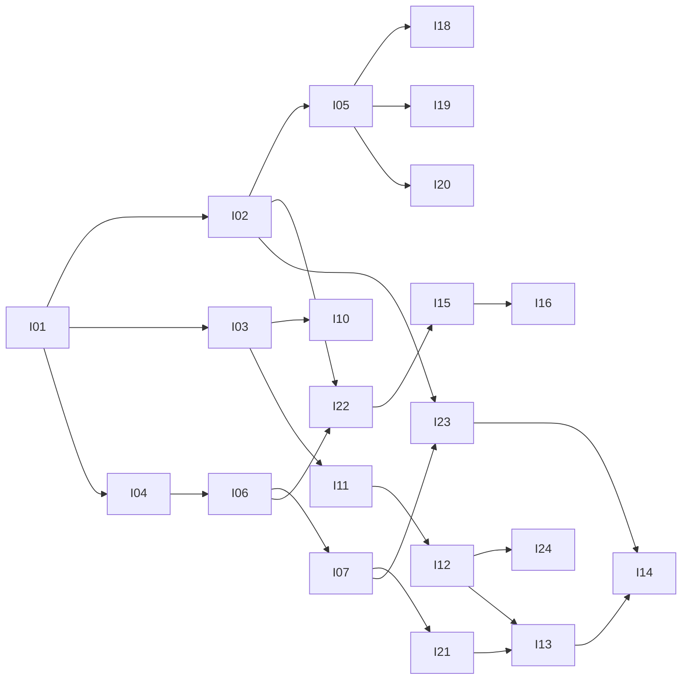

# 原子 Issue 任务板

## 当前版本：第四轮整改（2026-09-19）

当前版本应用验收已完成：离线 **541/0**，真实运行时 **19/19**、核心演示 **24/24**；本轮显式迁移学习门禁已有 **25/25**。P5 三臂同指纹、同配置，各 **9/9** 测量完整性检查，样本表现逐格报告。最新结论见 [R4 应用验收](../evidence/R4-acceptance.md)；下方第三轮材料保留为历史证据。

状态：`todo` / `active` / `done` / `blocked`。
完成级别：

| 级别 | 含义 |
|---|---|
| **L1 机制导入** | 代码已存在并有离线测试，但用户无法在界面上走完流程 |
| **L2 流程接通** | 用户可完成操作闭环，且有离线验证 |
| **L3 验收通过** | 该阶段的验收项已取得真实证据（真实模型或真实进程） |

**`done` 必须同时给出级别与证据。** L1 不得当作 L2 或 L3 汇报。真实模型门禁单列，不与离线测试混同。
接口以 [CONTRACTS.md](../specs/CONTRACTS.md) 为准；范围以 [specs/README.md](../specs/README.md) 为准。

## 依赖图

并行约束：同时最多 3 个实施单元；**同一文件同一时间只允许一个单元写入**（`runtime/agent.py` 与 `web_app/service.py` 是热点文件，必须串行）。

## 任务表

| ID | Spec | 工作 | 依赖 | 负责路径（写范围） | 状态 | 级别 |
|---|---|---|---|---|---|---|
| I01 | S01 | 分支、源码哈希、原目录快照核验 | - | `.local-planning/` | done | L3 |
| I02 | S01 | 运行时核心移植：主循环、模型双协议、工具调度、会话、压缩、事件化、工具路由 | I01 | `src/mellowday/runtime/*.py` | done | L1 |
| I03 | S01 | Skills 包移植：发现、元信息、词项检索、加载、演化、版本、评测 | I01 | `src/mellowday/runtime/skills/` | done | L1 |
| I04 | S02 | SQLite 事务存储与可撤销操作 | I01 | `src/mellowday/storage/` | done | L1 |
| I05 | S01 | Web 桥接：SSE 事件流、模型配置、会话隔离与恢复、并发排队 | I02 | `src/mellowday/web_app/{app,service,stream}.py` | done | L3 |
| I06 | S02 | 业务工具：事务 CRUD、事实生命周期、参数校验 | I04 | `src/mellowday/personal_assistant/` | done | L2 |
| I07 | S02 | 管理页、聊天、设置、历史、确认一次执行 | I05,I06 | `src/mellowday/web_app/static/` | done | L3 |
| I08 | S03 | 事实召回独立注入、显式指令优先于默认习惯 | I02,I04 | `src/mellowday/runtime/{memory,agent}.py` | done | L2 |
| I09 | S03 | 压缩预算、摘要折叠、原始历史独立保存与重启恢复 | I08 | `src/mellowday/runtime/`, `tests/runtime/` | done | L3 |
| I10 | S04 | 检索中文效果与相关性测试 | I03 | `tests/runtime/` | done | L1 |
| I11 | S04 | 明确反馈候选提取、合并去重、临时请求不学习 | I03 | `src/mellowday/runtime/skills/` | done | L3 |
| I12 | S04 | 习惯查看、启停、修改、版本恢复及界面 | I11 | `src/mellowday/web_app/` | done | L3 |
| I13 | S05 | 固定开发/保留案例，三条件可复现评测记录 | I21,I12 | `evals/` | done | L2 |
| I14 | S05 | 完整演示、文档、真实模型验收与失败记录 | I13,I23 | `README.md`, `docs/` | done | L3 |
| I15 | S06 | 每日回顾、主动问候设置与节流 | I06,I22 | `src/mellowday/personal_assistant/` | todo | - |
| I16 | S06 | 回顾设置接入与集成测试 | I15 | `src/mellowday/web_app/`, `tests/` | todo | - |
| I17 | S02 | 时间本地化：工具返回值与系统提示同时给出本地时间与时区 | I06 | `src/mellowday/personal_assistant/`, `src/mellowday/runtime/` | done | L3 |
| I25 | S01 | 修复并行工具调用被重复执行（继承缺陷） | I02 | `src/mellowday/runtime/agent.py`, `tests/runtime/` | done | L3 |
| I26 | S07 | Docker 部署适配：镜像、编排、数据卷、健康检查、真实容器验证 | I05 | `Dockerfile`, `.dockerignore`, `docker-compose.yml`, `docs/deployment.md` | done | L3 |
| I28 | S07 | 容器时区：默认 UTC 导致相对时间被存错 | I26 | `Dockerfile`, `docker-compose.yml` | done | L3 |
| I27 | S07 | 打包修复：静态资源随包发布（否则安装式部署无界面） | I26 | `pyproject.toml`, `tests/deployment/` | done | L3 |
| I18 | S01 | 断流后会话并发与任务回收 | I05 | `src/mellowday/web_app/service.py`, `tests/web_app/` | done | L3 |
| I19 | S01 | 会话标识校验与生命周期统一 | I05 | `src/mellowday/web_app/{service,app}.py`, `tests/web_app/` | done | L3 |
| I20 | S01 | 模型配置即时生效与设置入口同步 | I05 | `src/mellowday/web_app/{service,app}.py`, `src/mellowday/web_app/static/index.html`, `tests/web_app/` | done | L3 |
| I21 | S02 | 管理页补齐编辑/完成/撤销与本地时间显示 | I07 | `src/mellowday/web_app/static/{app.js,styles.css}` | done | L3 |
| I22 | S03 | 统一事实来源与每轮自动召回 | I06,I08 | `src/mellowday/personal_assistant/tools.py`, `src/mellowday/runtime/{memory,agent}.py` | done | L3 |
| I24a | S04 | 技能管理后端：列出、启停、版本列表与回退 | I11 | `src/mellowday/runtime/skills/`, `src/mellowday/web_app/skills_api.py` | done | L3 |
| I24b | S04 | 学习写入的确认接线与可见性（不静默拒绝） | I11 | `src/mellowday/runtime/{agent,events}.py`, `src/mellowday/web_app/static/app.js` | done | L3 |
| I24c | S04 | 技能管理界面（查看/启停/版本恢复） | I24a | `src/mellowday/web_app/static/` | done | L3 |
| I23 | S03 | 原始执行历史独立保存与折叠/重启连续性 | I02,I07 | `src/mellowday/runtime/sessions.py`, `src/mellowday/web_app/service.py` | done | L3 |
| I24 | S04 | 学习闭环：候选 → 确认 → 合并 → 启停 → 版本恢复（I24a/I24b/I24c） | I11,I12 | 见子项 | done | L3 |

可选 MCP 接入与独立复盘子任务：仅在演示确需时另开 issue，不作为默认能力。

## 本轮新增 issue 的验收标准

- **I18**：客户端中断流后，执行中的回合必须在会话锁释放前被取消并回收；同一会话任何时刻至多一个执行中的回合；断开后立即再发消息，历史不交错、无重复业务写入；新增断流回归测试。
- **I19**：`session_id` 统一校验（允许字符集与长度上限），含 `../`、绝对路径、空值一律拒绝且不产生任何文件；删除会话必须同时清理展示历史、运行时会话文件、折叠摘要与后台任务；删除后重新查询不得恢复内容。
- **I20**：保存设置后，已存在的会话在**下一轮**使用新模型与端点，历史不丢失；设置页模型选项包含当前默认模型并允许自定义输入；密钥仍不回显。
- **I21**：管理页可编辑标题/备注/时间、切换完成状态、撤销最近一次写操作；时间按本地时区显示；走通「管理页修改 → 聊天查询得到新值」。
- **I22**：事实只有 SQLite 一个来源；每轮对话自动召回相关事实进入上下文，无需模型显式调用工具；中文无空格输入也能召回；事实更新或删除后不再沿用旧值。
- **I23**：原始执行记录（含工具调用与结果）独立追加保存，不被折叠摘要或自动保存覆盖；折叠后仍能完成未完成任务；重启进程后可恢复并继续。
- **I24**：用户明确纠正后产生候选并在网页可见可确认；重复反馈合并不追加；可停用/恢复且影响后续新会话行为；被拒绝或跳过的写入在界面可见（不静默）。

## 历史验收标准（I01-I17）

- **I05**：`POST /api/chat` 返回事件流；会话状态隔离；配置读写不回显密钥；同一会话并发请求串行。**（断流场景未成立，由 I18 收口）**
- **I07**：聊天创建的记录在管理页可见；管理页修改后聊天查询得到新值；确认动作只执行一次。**（修改与撤销入口缺失，由 I21 收口）**
- **I08**：新会话使用正确事实；事实修改或删除后不再沿用旧值；当前明确指令覆盖默认习惯。**（自动召回未接通，由 I22 收口）**
- **I09**：长对话折叠后仍能完成未完成任务；原始历史不被摘要覆盖；重启后会话可恢复。
- **I11**：一次纠正改变后续新会话行为；一次性要求不落为永久规则；重复反馈合并而非无限追加。
- **I12**：停用/恢复规则实际影响后续执行；界面可查看版本。
- **I13**：三组条件（关闭 Skill、固定 Skill、学习后 Skill）其他变量一致；原始响应与工具调用留档。
- **I14**：README 只描述已实现内容；失败案例与改进记录在案。
- **I15**：回顾能关联真实事务；关闭主动问候后不触发；节流有效。
- **I16**：设置项经网页生效并有集成测试。

## 验证记录

### 2026-09-18 基线

I01 通过。分支 `refactor/mellowday-runtime`；HEAD `b047844`；源码基线 HEAD `9573e652`；13/13 文件哈希一致；原 ChatBot 工作区保持 6 个已修改 + 5 个未跟踪文件不变。

### 2026-09-19 P1 实施

- I02/I03/I04/I05/I06/I07/I10 落地，全量离线测试 98 → 106 → 111 passed。
- 实施中修复：8 处未指定 encoding 的中文文件 IO（cp936 下会静默丢数据）、`_slugify` 使中文记忆文件互相覆盖、源码 `_resolve_thinking_mode` 调用不存在的方法。
- 真实模型门禁执行并通过，见下。

### 2026-09-19 真实模型门禁（L3 证据）

模型 `deepseek-v4-pro`，端点 `https://api.deepseek.com`。详见 `docs/evidence/P1-real-model.md`，原始事件 `docs/evidence/raw/real-model-2026-09-19.jsonl`。

- 普通对话、流式回复：通过。
- 工具调用：`create_todo` 把「明晚七点」解析为 `2026-09-19T19:00:00+08:00` 并落库。
- 跨会话读回：新会话 `list_todos` 读到上一会话的记录。
- 事实记忆：`remember_fact` 写入后新会话 `recall_memories` 正确召回。
- 错误收敛：非法模型名 → `error` → `done`，不挂起。

### 2026-09-19 独立复核（主 agent 之外）

复核结论：P1 基本打通，P2 部分完成，P3/P4 机制已导入但未形成产品闭环，P5/P6 未实施。复核复现了 7 个问题，全部经主 agent 在代码中确认，已登记为 I18-I24：

1. 断流后同一会话可能并发执行（`web_app/service.py`）。
2. 会话 ID 未校验可越出会话目录，删除不完整（`web_app/service.py`）。
3. 保存模型设置后已有会话仍用旧配置；设置页模型选项不含当前默认模型（`web_app/service.py`、`static/index.html`）。
4. 管理页只有新建与删除，无编辑、完成切换与撤销入口（`static/app.js`）。
5. 事实写入 SQLite，运行时自动召回却扫描 Markdown；中文无空格输入跳过预取（`personal_assistant/tools.py`、`runtime/memory.py`）。
6. 折叠后的原始执行历史未独立保留，自动保存覆盖会话文件，网页历史不含工具调用（`runtime/agent.py`）。
7. 默认权限模式下后台学习写入被拒绝且不展示，可交互确认的提取方法没有网页入口（`runtime/agent.py`）。

主 agent 补充确认的两个同类问题：

- 管理页记录时间列直接显示 UTC `due_at`，与 I17 同类的用户可见错误（并入 I21）。
- `_auto_save` 写入的是折叠后的消息列表，折叠前的原始消息从会话文件消失（并入 I23）。

### 2026-09-19 I21 完成（L2）

- 管理页补齐行内编辑、完成/归档/失效切换、撤销上一步（operation_id 单次消费，重复点击给提示不发请求）、本地时间显示（优先 `due_at_local`，回退时按浏览器时区本地化 `due_at`/`created_at`）、错误提示行。
- 证据：`python -m pytest tests/web_app/test_static_assets.py -q` → 10 passed；静态断言做过 5 个变异校验（改坏优先级/改回 UTC/删提示/改坏 payload/改错路径全部被捕获）；真实进程 + 真实 Chromium（UTC+8）两轮 40+ 断言，含「管理页改标题 → 同一 store 的业务工具查询返回新值」。
- **发现的契约缺口**：`GET /api/records/{kind}` 只返回 store 原始行，不含 `due_at_local`；该字段目前只有 `personal_assistant/tools.py` 的 `_plain()` 会补。前端已兼容（自行本地化），但两个面向用户的时间出口规则不一致。已登记为 I21 的后端收尾项，由主 agent 在 `web_app/app.py` 补齐（单元 A 释放该文件后执行），并把本地化工具抽到共用模块，避免两处重复实现。

### 2026-09-19 I22 运行时侧完成（L1）

- 召回入口统一为 `recall_facts(query, fact_provider)`：不再扫描 Markdown，删除了 `MemoryPrefetch`/`start_memory_prefetch`（即「含空白字符才预取」的判据，全仓无残留）；中文按相邻双字词项命中；无 LLM side query；只注入 `status=active`；每轮注入前剥离上一轮注入，折叠摘要的 transcript 也先剥离，避免更新/删除后旧值回流。
- `Agent` 新增 `fact_provider`（契约 §4.1）与 `set_fact_provider`；未提供时不召回不报错，provider 抛错只记 warning。
- `build_fact_provider(store)` 提供候选；`recall_memories` 工具改为 active-only + 中文词项命中。
- 证据：`python -m pytest -q` → **183 passed**（新增 `tests/runtime/test_fact_recall.py` 16 项、`tests/personal_assistant/test_fact_provider.py` 11 项）。
- **仅 L1**：web 层尚未接线，`build_agent` 未传 `fact_provider`，因此「每轮自动召回」在真实产品路径上还未生效。接线由主 agent 在 `web_app/service.py` 完成；接线并跑真实模型门禁后才到 L2/L3。

#### 对「Store 中文检索缺陷」说法的更正（重要，避免记录错误结论）

实施单元曾判断 `store.search_records` 存在「中文缺陷」。主 agent 实测复核：`六点` → 命中 1、多词 `buy milk` → 命中 1、大小写不敏感 → 命中 1。
查询 `我几点下班` 返回 0 的原因与英文同构——它是**子串/词项检索**而非语义检索，英文问句同样查不到。**`search_records` 行为符合其 docstring，不记为缺陷。**
真正的需求是「召回排序」：用户自然语言与事实措辞不同（`我几点下班` vs `下班时间`），这属于召回层职责，已由 `build_fact_provider` 的中文双字词项排序解决，层次正确。

### 2026-09-19 I18/I19/I20 完成（L2）+ 主 agent 集成

- **I18**：先在旧代码上写出 5 个复现用例（`aclose()` 后动画代理仍 active；紧接第二轮 `max_active==2`），再修复。执行任务仍在锁内创建，`finally` 中 `abort()` + `cancel()` 并 `asyncio.wait` 等到 runner 真正结束**之后**才退出 `async with`；文本在 sink 产生时即记录，被取消回合仍落一条助手历史且只落一次；`dropped` 墓碑防删除后复活。证据：`tests/web_app/test_turn_lifecycle.py` 7 passed（连跑 3 次稳定）。
- **I19**：`[A-Za-z0-9_-]{1,64}` 边界校验，非法 id 不产生任何文件；`drop()` 清理展示历史 + runtime 会话文件 + 折叠摘要 + 内存状态 + 待确认项并中止回合；新增 `adrop()` 等待回合真正停止。证据：26 passed（17 个非法 id 参数化用例）；真实进程冒烟确认删除后 sessions 目录为空、重复删除 404、`../evil` → 400。
- **I20**：每轮持锁后、启动执行前重读配置并应用；仅端点或凭据变化才重建 client；历史、tools、session_id、system prompt 保留。`index.html` 模型控件改为可输入的 datalist（含 `deepseek-v4-pro`、`deepseek-flash`）。证据：7 passed；冒烟 `models_used = [smoke-model-1, smoke-model-1, smoke-model-2]`、`messages_per_call = [2,3,5]`。
- 真实进程冒烟脚本 `tests/web_app/smoke_real_process.py` → 17 checks passed（真实 uvicorn + 本地假模型，无外网；子进程环境已剥离 `MELLOWDAY_*`，不读 `.env`）。

#### 主 agent 集成（本轮）

- **I22 接线完成，升至 L2**：`build_agent` 传入 `fact_provider=build_fact_provider(store)`，事实召回与业务工具写入共用同一 SQLite 来源。新增端到端测试 `tests/integration/test_fact_autorecall.py`（3 项）证明：事实出现在**第一次**模型请求中且不需要任何工具调用；更新后旧值不再出现；删除后彻底消失。这是单元测试无法覆盖的部分——没有它，召回逻辑在真实路径上是死代码。
- **时间本地化统一**：新增 `src/mellowday/timefmt.py`（`to_local_iso` / `localize_record`），聊天工具与 Web 记录接口共用同一实现，消除此前「聊天给本地时间、管理页给 UTC」的两套规则。`GET/POST/PATCH/DELETE /api/records/*` 现在都返回 `due_at_local`。

### 2026-09-19 I24a 完成（L2）+ 技能路由挂载

- 新增 `runtime/skills/skill_management.py`（列表/启停/版本列表/回退）与 `web_app/skills_api.py`（仅导出 router）。
- **停用语义**：整个技能目录移入既有归档目录（复用剪枝命名，不另造禁用名单）；归档目录无直接 `SKILL.md`，发现逻辑天然不加载。验收证据：热缓存后停用，`discover_skills`/`get_skill_by_name`/`retrieve_relevant_skills`/`build_skill_descriptions`/`build_system_prompt` 全部不再出现该技能，恢复后全部回来，同目录其它技能不受影响。
- **回退语义**：旧版本正文写回 `SKILL.md` 并记为新版本（补丁位 +1，加 `restored-from`），覆盖前先把当前内容追加为历史快照，因此回退可再回退。
- 证据：26 passed（运行时 17 + 接口 9）；中文技能名在归档/恢复/回退全程 utf-8 无损。
- **主 agent 接线**：`app.include_router(skills_router)` 已挂载，并放在 `/api/{unmatched:path}` 兜底路由**之前**（实施单元实测：顺序反了会被兜底 404 吃掉）。实测 `GET /api/skills` → 200、未知技能 disable → 404、未知路由 → 兜底 404。契约第 4.5 节已补充接口、语义与挂载顺序。

### 2026-09-19 I24b 运行时侧完成（L1，待 web 接线）

- `_confirm_background_online_skill_write` 改为：有 `confirm_fn` → 调用它；没有 → 保持拒绝并发出 `skill_write_denied{reason: no_confirmer}`，**不再静默**。
- 技能候选写入路径**无静默分支**：每个提前 return 发 `skill_candidate_skipped`，成功发 `skill_candidate_applied`（add/merge），`online_ingest` 抛错发 `skill_candidate_failed`，discard 发 skipped 并带理由。
- 新增回收接口：`drain_background_skill_tasks(timeout=None)`（超时不取消任务）、`has_pending_background_skill_tasks`、`cancel_background_skill_tasks()`（会话删除用）。
- **同类缺陷修复（主 agent 确认口径正确）**：`_confirm_online_skill_write()` 与 `_confirm_dangerous()` 原先在调用 `confirm_fn` 之前先发一条**无 token** 的 `confirmation`，网页层 `confirm_fn` 又发一条带 token 的，导致前端出现两个确认框且其中一个点击无响应。现已只在「无人可问」时发无 token 确认。该规则已写入契约第 3 节。
- 证据：`tests/runtime/test_skill_learning_flow.py` 15 passed；`tests/runtime` 101 passed；全量 228 passed。变异校验：恢复原来的静默拒绝 → 3 个用例失败；删除 denied/failed 事件 → 4 个用例失败。
- **仅 L1**：探针实测现状下用户看不到任何学习反馈（0 条 confirmation、0 条学习事件、0 个技能落盘），因为后台任务在事件流关闭、sink 复位之后才执行。缺口有两处：(a) `service.py` 需在 `channel.close()` 之前 `await agent.drain_background_skill_tasks(timeout=...)`；(b) 前端需渲染上述 5 类事件。两处均需等待当前持有这些文件的单元释放（I23 持 `service.py`，I24c 持 `static/**`）。

#### 已知限制（记录，不阻塞）

`runtime/skills/skills.py` 的 `_cached_skills` 是**进程级全局缓存、不按数据目录区分**，仅在 `reset_skill_cache()` 后刷新。同进程内 create/evolve/disable/restore 都会触发 reset，正常使用无碍；但外部进程或手工编辑写入的技能在 reset 前不可见，且按目录隔离的测试会互相泄漏。若后续出现「技能改了但没生效」的报告，先怀疑此处。

### 2026-09-19 I24c 完成（L2）+ I24b 前端渲染补齐（L2）

- **I24c**：侧栏新增「习惯」入口与技能视图；列表（名称/描述/版本/来源/本地化更新时间/启用徽章）、停用与恢复、版本展开与「当前版本」标记、回退二次确认（第一次点击不发请求）、停用态提示「请先恢复该技能再回退版本」、失败时提示行显示 HTTP 状态与后端 detail。原有七个视图未动。
  - 证据：`tests/web_app/test_skills_ui.py` 18 passed；**变异校验 10/10 全部被捕获**。实施单元主动披露：第一轮 M2 曾 MISSED（只断言了常量名而非文案本身），补上字面断言后才 10/10——这种披露比「全绿」更有价值。
  - 另做了真实 uvicorn + 真实 Chromium 验证（34/34），含计算样式确认 CSS 真正命中；临时脚本未进仓库。
  - 未验证：真实对话中「习惯停止被执行 → 恢复后重新生效」，属主 agent 的 L3 门禁；并发多标签页与超大列表未测。
- **I24b 前端渲染（主 agent 补齐）**：`app.js` 新增 5 类学习事件的渲染与拒绝原因文案表（user_denied / no_confirmer / permission_mode / disabled / plan_mode / no_window / no_model_client / skills_unavailable，以及 confirm_error: 与 permission_mode: 前缀），未知原因回退为可见文案；`skill_candidate_applied` 会刷新习惯列表。
  - 证据：`tests/web_app/test_learning_events_ui.py` 16 passed；**变异校验 2/2**。第一轮断言 `no_confirmer:` 会被重命名后的 `xno_confirmer:` 满足（假通过），已改为锚定行首键名 `\n  <reason>: "` 后重跑，变异被正确捕获。

### 2026-09-19 真实模型 L3 门禁（P3 事实 / P4 学习闭环）

详见 `docs/evidence/P3-P4-l3-gate.md`，原始报告在 `docs/evidence/raw/gate-l3-report.json` 与 `gate-l3-learning-report.json`。

**行为门禁 6/6 通过**：习惯仅在启用时进入新会话提示词（确定性）；启用时改变行为（抽样命中 1/2）；停用后绝不出现（0/2）；保存的事实无需工具调用即被使用；改模型即时生效且历史不丢；删除会话清理全部产物。

**学习闭环门禁 3/3 通过**：一次明确纠正 → 候选提取 → 带 token 的确认 → 写入技能 `daily-planning-output-format` v0.1.0 → 进入全新会话提示词 → 两个新会话均按新规则作答（2/2）。**这是 P4「一次纠正改变后续新会话行为」首次取得真实模型证据。**

#### 门禁暴露并修复的严重继承缺陷（I25）

首次运行学习门禁时纠正轮完全无输出，API 报 `400 Duplicate value for 'tool_call_id'`。
根因：`_chat_openai` 中「分批 + 执行工具」整段被缩进在 `for tc in tool_calls:` **循环内部**，每处理一个工具就把此前累计的全部工具再处理一遍。
后果：(1) 一轮 N 个工具调用被执行 1+2+…+N 次 → **重复业务写入**；(2) 同一 `tool_call_id` 重复入列 → **会话被 API 永久拒绝**。
这正是学习闭环此前跑不通的原因：触发纠正的规划轮一调用多个工具，会话立即损坏。
该结构在参考实现中同样存在（源文件 1688/1687 行同为 16 空格缩进），属**继承缺陷**而非移植回归。
修复：整段减一级缩进移至循环之后；新增 `tests/runtime/test_parallel_tool_calls.py`（3 项）；变异校验（把缩进改回去）3 项全部失败。

#### 门禁设计修正

第一版门禁把「停用后行为消失」写成单次断言，当时习惯根本未生效、标记永不出现，检查因此**假通过**。已加入 `meaningful: habit_on` 前置条件，并把「模型是否遵循习惯」明确改为抽样（单次采样在 temperature=1 下两个方向都会说谎）。

### 2026-09-19 部署准备：打包缺陷 I27

为 Docker 部署做前置核对时发现：`pyproject.toml` 没有声明 package data，`pip wheel .` 产出的 wheel **不含任何静态资源**（40 项里 static 条目为 0）。
后果很隐蔽：安装式部署的容器会正常启动、`/api/health` 正常返回，但 `/` 没有任何界面——健康检查全绿而产品不可用。
已在 `pyproject.toml` 增加 `[tool.setuptools.package-data] mellowday = ["web_app/static/*"]`，重建 wheel 后确认三个静态文件均已包含。

### 2026-09-19 I26 容器化部署完成（L3）+ I28 时区缺陷

**I26（L3，真实容器证据）**：三阶段 `Dockerfile`（非 root uid 1000、显式 C.UTF-8、构建期断言 wheel 内含 `web_app/static/index.html`）、`docker-compose.yml`（`name: mellowday`、端口只绑 127.0.0.1、命名卷、`env_file` 可选、`MELLOWDAY_ENV_FILE=""` 关闭容器内 .env 读取）、`.dockerignore`、`.env.docker.example`、`docs/deployment.md`、`tests/deployment/test_packaging.py`（离线，变异校验：删掉 package-data 声明后 2 项失败）。

主 agent 独立复核（非转述）：容器 `Up (healthy)`；`/api/health` 200 且 `model_configured: true`；`/` 200 / 4381 字节 / 含 MellowDay 品牌；`id` 为 uid=1000；镜像 `/app` 只有 `. .. data`（无源码、无 `.env`）；**真实模型一轮经容器完成工具调用并落库**。

**I28（主 agent 复核时发现，L3）**：容器默认 UTC，导致「明天上午九点」被存成 `09:00Z`，UTC+8 用户会看到 **17:00**。
同一数据库里留下了修复前后的对照：修复前 `due_at_local = 17:00+08:00`（错），修复后 `01:00Z / 09:00+08:00`（对）。
修复：镜像 `ENV TZ=Asia/Shanghai` + compose `TZ: ${TZ:-Asia/Shanghai}`，可覆盖；基础镜像自带 tzdata，无需额外安装。
这类缺陷不会被健康检查或界面测试发现——容器健康、界面正常、只有用户看到的时间是错的。

另外修正两处由主 agent 处理的问题：`.env.docker.example` 被 `.gitignore` 的 `.env.*` 规则吞掉（已加 `!.env.docker.example`）；`Dockerfile` 注释中出现同工作区另一个项目的名称（已移除，公开材料不留跨项目引用）。

### 当前测试状态

`python -m pytest -q` → **506 passed / 0 failed**（离线；测试套件读不到 `.env`、不发起网络请求）。

---

## 第三轮（mellowday-round3）：复核返工与 P3/P4 闭环

起点 369 passed / 7 failed → 终点 **506 passed / 0 failed**。三次独立复核（t6/t14/t18）均判 needs_revision，
终局复核（t25）判 **pass**。团队状态 `escalated`（评审循环到达上限，**不是**用户中止）。

### 第二轮 6 条线索：全部先复现再修

| 线索 | 复现证据 | 结论 |
|---|---|---|
| A 删除会话后排队请求仍执行 | 调用序列 `A chat → abort → abort → B chat` | 已修（锁后立即查 dropped） |
| B 撤销覆盖后续修改 | 改标题 op1 → 改备注 op2 → undo(op1) 后备注 D1→D0 | 已修（改为冲突检测拒绝，HTTP 409） |
| C 合并丢失旧规则 | 参考实现同写法（继承缺陷 H2） | 已修（discard 终态 + 保留式合并） |
| D 失效事实仍被当当前事实 | 门禁 `payload_leaks=2` | 已修（取代机制，见下） |
| E 执行记录截断/长结果取不回 | trace 截 4000 字符 | 已修（完整保存 + 有界展示 + ref HTTP 取回） |
| F 规则不可见不可管 | 管理页仅名称/描述/版本 | 已修（查看/编辑/版本/回退 + 停用真生效） |

### 取代机制：连续四个入口，最后一次用不变式收口

同一类缺陷（规则同时存在于技能库与事实库，导致「停用习惯」失效）被发现了**四次**：

| 轮次 | 入口 | 修法 |
|---|---|---|
| 1 | 纠正窗口内重复 | 同窗口清扫（t9） |
| 2 | 确认被拒绝路径留下的孤儿事实 | 范围扩到**全库 active**（t16） |
| 3 | 重复反馈轮（discard 分支无写入 → 取代不触发） | 触发条件由「技能被写入」改为「**规则有认领者**」+ **结构性不变式**（t21） |
| 4 | 停用期间重述规则 | 认领者集合扩到**全技能库（含停用/归档）**（t24） |

**关键交付是第 3 轮引入的不变式**：遍历「全库 active 事实 × 技能库全部正文」，断言不存在实质重叠。
它把「枚举入口」换成「断言终态」。实测在三个历史入口上都会变红（M1 18 failed / M2 孤儿那条红 / M3 写入后那条红）。
已知边界：终态断言无法区分「仅窗口 vs 全库」（同场景终态相同），scope 差异由孤儿场景覆盖。

### 判据与测量工具自身的缺陷（本轮最该记住的一类）

| 缺陷 | 表现 | 处置 |
|---|---|---|
| 停用侧探针假阴性 | payload 已含规则正文（经 facts 段）时仍判 passed，`payload_leaks=0` | 改用三段探针、复用门禁同一实现 + 自检 |
| 结构判据机会性假阳性 | 载荷 0 处规则文本（`payload_carriers=0`），回复形状偶然吻合被判命中 | **不放宽判据**；保留反例；收紧建议留下一轮 |
| 门禁自身两个 bug | meta 已是 dict 又 json.loads；折叠断言残留 present_anywhere | 自行追查并修正后才转绿 |
| 工具自身缺陷 | 加粗小结行被当成第 4 条重点任务；`--selfcheck` 曾是死开关 | 补可执行负向对照；现 24/0/0 |

**自检现在覆盖了本轮真实踩过的每一类坑**（`item_count_ignores_bolded_headings`、`off_side_accepts_a_valid_absence`、
`probe_location_separates_fact_blocks_from_the_rest`、`leak_scan_catches_a_credential_shape` 等）。

### 终局证据（冻结指纹 `0c0c0d7f636fde67`，105 文件，运行期间 0 变化，凭据 0 命中）

| 项 | 结果 |
|---|---|
| 核心演示 | 23/1/0；唯一红项为判据机会性假阳性（`payload_carriers=0`）。独立复核同指纹重跑 **24/0/0** |
| P5 三条件 | 三臂**同指纹**、各自独立进程、每臂 9/9；六格 off `0/3 & 0/3`、fixed `2/3 & 3/3`、learned `3/3 & 3/3`；事实通道六格全 `0/3`；未宣称提升比例 |
| 学习门禁 | **38/0/0**（孤儿事实被学到的技能认领 1/1，`active_rule_facts=0`；停用侧载荷三段全空） |
| 演示自检 | 24/0/0 |
| 终局独立复核 t25 | **pass**（自己重跑、自己只读 SQLite 与 model-calls.jsonl 核对、自己重算六格） |

### 已知限制（有意不修，记录以免被当成遗漏）

- **管理页未显示「取代它的习惯当时已停用」**：`superseded_skill_state` 已在 DB/API 可读，仅徽章文案缺少该状态；
  t23 运行期间不便改 static/**（会破坏指纹），留下一轮。
- **结构判据灵敏度**：两个已知反例（演示第 8 行 1/2、t23a 的 P5 off 开发格 1/3）；收紧建议会改变分母，不能与本轮数字混用。
- **长结果 ref 的 HTTP 取回**未纳入演示/P5 证据面（功能本身有测试与真实进程证据）。
- `runtime/skills` 的 `_cached_skills` 是**进程级全局缓存、不按数据目录区分**；P5 已用独立进程隔离规避。
- P5 样本 n=3；dev 与 holdout 共用臂内运行目录（文档已声明）。

### 更正记录（不做粉饰）

- **第二轮那条 L3 结论已作废**：「习惯仅在启用时进入新会话提示词」当时只验证了技能通道，
  未验证实际请求载荷，属**假阳性**；事实通道当时仍在注入规则。`docs/evidence/P3-P4-l3-gate.md` 顶部已标注。
- 主控调度失误两次：在证据运行进行中派发代码改动（t15、t20），导致工作区指纹变化 / 跨臂不可比。
  收口运行前已明确冻结派发。
- t13/t15 曾重复建同范围任务，浪费一次核心演示运行；此后先确认运行时是否已自动建轮次再手工建单。
