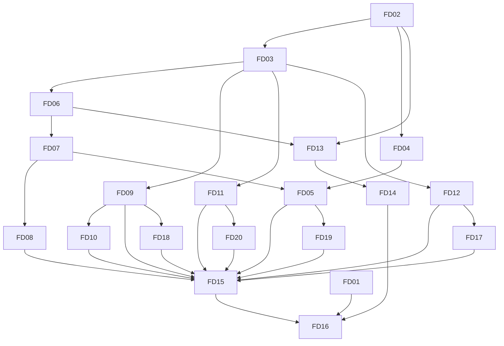

# 前端与部署原子 Issue 板

2026-09-19，S08–S12 已实施并验收。当前结果见 [FD 验收报告](../evidence/FD-acceptance.md)。

状态：todo / doing / review / done / blocked。done 必须有对应可复核证据；依赖表示集成完成条件，依赖公共契约的任务可在契约冻结后并行实现。

| Issue | Spec | 原子交付 | 依赖 | 独占写入 | 状态 |
| --- | --- | --- | --- | --- | --- |
| FD01 | S12 | 核实实际运行时主链与来源公开边界 | 无 | 本地内部来源审计 | done |
| FD02 | S08 | Vue/TS/Vite 工程、锁文件、开发代理 | 无 | package/config/main | done |
| FD03 | S08 | HTTP/DTO 错误契约 | FD02 | api/http、types | done |
| FD04 | S08 | 五主题、授权、偏好恢复 | FD02 | appearance、assets | done |
| FD05 | S08 | 路由、导航、窄屏抽屉与最近会话 | FD03、FD04、FD07 | App/router/styles | done |
| FD06 | S09 | POST SSE 解码与中断协议 | FD03 | api/sse 与测试 | done |
| FD07 | S09 | 会话状态、确认、学习、发送停止 | FD06 | conversation 与测试 | done |
| FD08 | S09 | 历史、删除、ref 分页搜索与竞态 | FD03、FD07 | history 与测试 | done |
| FD09 | S10 | 五类记录 CRUD/状态/撤销冲突 | FD03 | records 与测试 | done |
| FD10 | S10 | 今日只读派生 | FD09 | today 与测试 | done |
| FD11 | S10 | Skills 详情编辑/启停/版本回退 | FD03 | skills 与测试 | done |
| FD12 | S10 | 有效模型配置与健康状态 | FD03 | 两个 settings 页面 | done |
| FD13 | S11 | 前端镜像与同源流式 Nginx | FD02、FD06 | frontend Docker/nginx | done |
| FD14 | S11 | Compose 双服务、健康、卷升级/回退 | FD13 | 根 Compose、部署脚本/文档 | done |
| FD15 | S12 | 新浏览器行为/视觉与后端回归 | FD05、FD08–FD12、FD17–FD20 | 集成测试与证据 | done |
| FD17 | S10 | 清空已保存的最大工具轮次 | FD12 | config 与定向测试 | done |
| FD18 | S10 | 状态大小写与 Store 过滤一致 | FD09 | recordModel 与测试 | done |
| FD19 | S08 | 最近会话加载不得覆盖后续导航 | FD05 | App 与导航测试 | done |
| FD20 | S10 | Skills 写入后的刷新隔离旧响应 | FD11 | SkillsPage 与竞态测试 | done |
| FD16 | S12 | 真实容器、迁移恢复、模型冒烟与交付 | FD01、FD14、FD15 | 最终证据、README | done |

## 批次、owner 与循环控制

- 批次 A：主 agent FD02/FD03，源码审计 agent FD01；先冻结公共接口。
- 批次 B：对话 agent 独占 FD06–FD08；主 agent 实施外观、导航、管理和 Docker。实际没有派生管理或部署 agent。
- 批次 C：主 agent 串行集成、真实模型及卷迁移；复用审计 agent 检查源码/镜像边界，复用对话 agent 只读复核管理与导航。发现的缺陷由主 agent 集中修复。
- 并发上限三个子 agent，本轮实际复用两个，无递归派生；每个子任务返回文件、测试命令与结果、风险、未完成项。相同失败两轮后交主 agent，改为定位原因而非继续盲试。
- 检查点在 `.local-planning/checkpoints/frontend-rollout.md`；压缩恢复先读取索引、任务板、检查点及当前 git/agent 状态。子任务不提交推送，参考目录只读，测试数据隔离。

## 每项验收锚点

FD01：实际文件/哈希/主链对照和公开扫描。FD02：npm ci/check/build。FD03：错误/ok:false 不吞掉且 mutation 不重试。FD04：五主题/损坏存储/刷新。FD05：各路由、手机导航、焦点/IME。FD06：分块中文/多帧/异常 EOF。FD07：done/确认一次/学习结果/停止与导航。FD08：长原文拼接/搜索重置/会话隔离。FD09：真实 records CRUD/状态/409 撤销。FD10：跨日/完成/无日期。FD11：停用限制和整版本恢复。FD12：脱敏/环境覆盖/健康。FD13：无缓冲与静态/API 错误。FD14：隔离卷重建/备份/恢复/回退。FD15：当前 Vue 和真实 HTTP 的浏览器结果及后端回归。FD16：当前镜像实测与文档事实一致。

FD17：后端清空限制用例 + 浏览器保存/清空/刷新。FD18：大写 DONE 不进入今日、SUPERSEDED 不活跃。FD19：延迟请求不得覆盖新导航，失败不跳转且可见。FD20：先刷新再停用，旧响应最后返回也不能恢复旧状态；已做红绿验证。

P6、完整人格配置和大样本学习效果不在本轮完成范围。详细测试与失败记录见验收报告。
