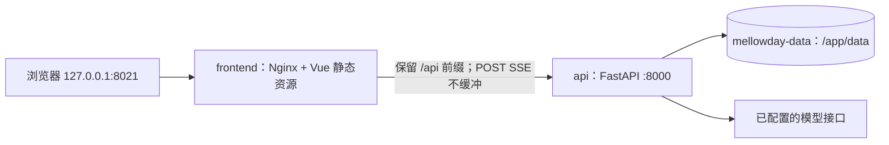

# MellowDay 前端重构与 Docker 前后端部署计划

日期：2026-09-19。下文保留初始计划背景；用户随后授权实施。当前规格、issue 和验收以 [专项 Spec](../specs/FRONTEND-ROLLOUT.md) 及 [任务板](../issues/FRONTEND-BOARD.md) 为准。

## 1. 目标与建议

以原版 MellowDay 的界面、主题和信息结构为产品基准，采用 Vue/Vite 工程、独立前端镜像、同源代理和浏览器验收方法，接入当前已经验收的 MellowDay 后端。具体参考目录与来源对应保存在本地内部记录。

建议采用 **Vue 3 + TypeScript + Vite + Vue Router**，生产环境采用 **Nginx 前端容器 + Python/FastAPI 后端容器 + 现有持久数据卷**。后端运行时、学习流程、会话、SQLite 和 Skills 继续沿用当前实现。

实施采用上述 Vue 方案；以下比较保留技术选择依据。实际完成项和证据见专项 Spec、任务板与验收报告。

本轮交付范围：恢复原版主要视觉与导航，完整接入现有后端支持的功能，保留重构版新增的 Skills、学习反馈和执行记录能力，完成可重建、可升级、可回退的双容器部署。

## 2. 已核实的基线

| 项目 | 当前事实 | 对本计划的影响 |
| --- | --- | --- |
| MellowDay-Rebuild | 分支 `refactor/mellowday-runtime`，HEAD `00e85a68370f9f5c0d2ce2fb3bae301dd83b0239`；计划开始时工作区干净 | 从已验收版本增量实施，不再重写后端 |
| 当前前端 | `src/mellowday/web_app/static/` 下的 HTML、CSS、原生 JavaScript，由 FastAPI 和 wheel 提供 | 新增独立 `frontend/`；明确新旧入口与测试覆盖 |
| 原版 MellowDay | 本地只读设计基线；前端为 React + TypeScript + Vite | 复用设计、素材和适用的纯 TypeScript 逻辑；Vue 页面需要转换 |
| 工程参考 | 本地只读工程基线；Vue 3 + Vite，Node 构建、Nginx 运行 | 参考工程与部署组织方式；聊天协议和依赖按当前后端适配 |
| 当前 Compose | 项目名 `mellowday`，服务 `web`，宿主机 `127.0.0.1:8021`，容器端口 `8000` | 切换后将 `8021` 交给前端，后端仅在容器网络内监听 |
| 当前数据 | `/app/data`；命名卷按现有项目名为 `mellowday_mellowday-data` | 实施前再核对真实挂载；沿用数据卷，不意外创建空卷 |
| 已有验收 | [R4 报告](../evidence/R4-acceptance.md)：离线 541 项、进程/浏览器/wheel/Docker 等检查有历史证据 | 这些是旧版本证据，新前端与代理必须重新验收 |
| 尚未完成 | P6 每日回顾和主动问候未实施 | 本轮不把对应旧页面视为已有后端能力 |

两个参考目录存在与本任务无关的未提交文件，只读使用，不切换、覆盖或提交它们。

### 关键参考位置

- 当前契约：[CONTRACTS.md](../specs/CONTRACTS.md)；总体路线：[IMPLEMENTATION_PLAN.md](../../IMPLEMENTATION_PLAN.md)。本计划是其前端和部署专项补充。
- 当前 HTTP/流式行为：`src/mellowday/web_app/app.py`、`service.py`、`stream.py`、`skills_api.py`。
- 设计范围：应用壳、外观、对话、生活、记忆、设置与全局样式；具体只读目录见本地内部记录。
- 本轮素材许可见 [ASSET_SOURCES.md](../../ASSET_SOURCES.md)。
- 工程范围：package、Vite 配置、Dockerfile、Nginx、Compose 与浏览器验收。

本计划依据文件与现有证据编写；未把源码阅读视为新版本运行验收，也未进行新的图索引或模型评测。

## 3. 技术选择

| 方案 | 收益 | 成本与适用条件 | 本次建议 |
| --- | --- | --- | --- |
| Vue 3 + Vite + TypeScript | 工程、开发代理和镜像组织简单；适合本地助理 SPA | 原版 React/JSX 和 hooks 需重写为 Vue，旧 HTTP 调用也需适配 | 作为本计划默认路线 |
| React + Vite + TypeScript | 可保留更多原版组件和测试，迁移工作量较小 | 组件写法不同，但部署方式可以一致 | 若优先减少重写，这是合理备选 |
| Next.js | 适合需要 React 服务端渲染、服务端页面逻辑等的产品 | 当前未发现 SSR/SEO 需求；完整服务端部署会增加 Node 运行服务，静态导出也没有明显收益 | 本轮不引入 |

Vue 与 Next.js 是不同技术路线，不组合使用。也不为此次重构额外引入 Nuxt、Redis、Chroma 或模型下载流程。

工程约定：

- 使用 Node 22 的受支持补丁版，实施时核对 Vite/Vue 插件的最低 Node 要求，并固定兼容版本及 `package-lock.json`；安装使用 `npm ci`。
- Vue 单文件组件使用 `<script setup lang="ts">`；使用 Vue Router 的 hash 模式，保留原版 `#/conversation` 等链接形式。
- 提供 `dev`、`check`、`test`、`build`、`test:e2e` 脚本；`check` 包含 `vue-tsc --noEmit`，测试采用 Vitest、Vue Test Utils 与 Playwright。
- 状态优先由专门的 composable/module 管理；目前不需要 Pinia 或一套通用状态框架。
- 沿用原版 CSS 变量和主题设计，不默认套用会改变原版外观的大型 UI 组件库。
- Markdown 采用 `markdown-it`，关闭原始 HTML，限制危险链接协议；模型文本、工具结果、技能正文均按不可信内容渲染。

## 4. 页面与能力迁移矩阵

主导航保留“对话 / 今日 / 生活 / 记忆 / 设置”；“生活”下保留任务、提醒、日历、笔记。“设置”下将当前 Skills 管理纳入“习惯与技能”，保持容易到达。

| 页面或交互 | 原版参照 | 当前后端对应 | 本轮做法与限制 |
| --- | --- | --- | --- |
| 应用外壳与导航 | AppShell、最近对话抽屉、窄屏导航 | 会话列表与详情 | 恢复布局、路由、折叠、返回和焦点行为；不展示无效的桌面窗口按钮 |
| 外观 | 晴空、樱粉、薄荷、夜色、简约 | 浏览器本地偏好 | 恢复五种主题、简约参数和装饰素材；保留偏好格式的容错读取 |
| 对话 | ConversationSurface、输入区、消息展示 | POST `/api/chat`、停止、确认 | 以当前 POST SSE 协议重建；支持文本、工具、错误、学习结果和有效确认 |
| 最近对话、历史 | RecentConversations、ConversationHistory | GET/DELETE `/api/sessions` 及详情 | 列表、载入、继续、删除、完整执行轨迹；当前无重命名/归档接口，不显示可用按钮 |
| 今日 | TodayPage | `todos`、`calendar`、`reminders` | 做只读当日概览，按真实记录和时区派生；提供跳转管理入口，不调用旧每日回顾接口 |
| 任务 | LifeTasksPage | `/api/records/todos` | 新建、编辑、完成/重新打开、删除和撤销，使用真实状态值 |
| 提醒 | LifeRemindersPage | `/api/records/reminders` | 管理提醒记录；实际推送/通知调度不因页面恢复而视为已实现 |
| 日历 | LifeCalendarPage | `/api/records/calendar` | 展示和编辑已有时间记录；当前主要字段为 `due_at`，不伪造原版开始/结束时段能力 |
| 笔记 | LifeNotesPage | `/api/records/notes` | 列表、搜索、编辑、归档/恢复及现有撤销能力 |
| 记忆 | MemoryManagementPage | `/api/records/memories` | 保留 active/expired/deleted/superseded 语义、替代关系展示和已有恢复限制，不把记忆合并进聊天历史 |
| 习惯与技能 | 使用原版管理页视觉，功能来自重构版 | `/api/skills` 全部现有接口 | 列表、详情、正文编辑、启停、版本原文与整版本恢复；保留来源、失败原因和禁用限制 |
| 模型设置 | ProviderSettingsPage | GET/PUT `/api/config` | 接入单个当前模型配置，自定义模型名、thinking、max_turns；不展示未支持的多提供方配置管理 |
| 运行状态 | DiagnosticsPage | `/api/health` 与公开配置 | 仅展示可核实的健康、模型是否配置及错误；健康不等于真实模型调用成功 |
| 操作记录 | OperationRecordsPage | mutation 的 `operation_id`；会话 trace | 本轮展示当前操作回执、撤销反馈和会话执行记录；没有全局审计列表接口，不冒充完整审计页 |
| 人格设定、主动聊天、完整每日回顾 | 原版相应页面 | 当前缺少管理/业务接口 | 后续专题；本轮不放可保存但无效果的配置项，保留页面设计参照 |

原版固定示例卡片不进入正式页面。所有空态、加载失败和功能限制都用实际状态表达。

“今日”的规则单独测试：按浏览器本地日界线计算当日，明确呈现所用时区；有效待办/日历/提醒分别展示，无日期记录不误算为今天，过期和完成记录按明示规则过滤。后端容器仍默认 `Asia/Shanghai`，提交时间使用带偏移或 UTC 的 ISO 时间。

素材复用保留原版 MIT 来源记录与 Inter 的 SIL OFL 1.1 授权文件。将原来的 `/static/replacement/runtime/...` 引用迁移到新构建资源路径，验证离线字体和素材加载；不携带参考仓库的个人数据或环境文件。

## 5. 前端结构与接口职责

建议目录（实施时按实际体量细分，避免先建空框架）：

```text
frontend/
  package.json / package-lock.json / tsconfig*.json
  vite.config.ts / vitest.config.ts / playwright.config.ts
  index.html / Dockerfile / nginx.conf / .dockerignore
  public/runtime/                   主题、图标、字体授权
  src/
    main.ts / App.vue
    app/                            路由、导航、应用级依赖装配
    appearance/                     主题状态、token、装饰
    api/                            HTTP、POST SSE、DTO 与错误解码
    conversation/                   会话状态、消息、确认、输入
    history/                        历史、执行轨迹、长结果原文
    records/                        五类记录的交互与时间处理
    today/                          已有记录的当日派生视图
    skills/                         详情、编辑、启停、版本
    settings/                       外观、模型、运行状态
    components/                     少量共用交互组件
    styles/                         原版主题和布局的适配
  tests/                            用户行为、协议与浏览器验收
```

四个需要集中复杂度的 Module：

| Module | 对调用方的 Interface | 内部负责的 Implementation |
| --- | --- | --- |
| 会话 | 读取当前状态、发送、停止、作出确认决定、选择会话 | reader、事件解码、请求归属、轮次状态、确认去重、历史刷新 |
| 记录管理 | 按类型读取、保存、改变状态、删除、撤销 | 字段映射、错误说明、operation_id、冲突和时区处理 |
| 历史与原文 | 读取会话、展开/搜索/继续读取指定 ref | trace 展示、分页游标、竞态、错误和会话隔离 |
| 外观 | 读取偏好、选择主题、调整简约参数 | 本地存储容错、token 计算、素材路径、偏好迁移 |

页面通过这些 Interface 操作，不各自创建 SSE reader 或复制确认规则。HTTP 是面向当前 FastAPI 的 Adapter；测试可在相同 Seam 注入受控响应，不创建尚无用途的“多后端平台”。

状态归属：服务器保存事实、会话和技能；浏览器只保存外观、导航偏好及必要的会话选择。记录草稿、网络请求、有效确认 token 和活动轮次保存在内存，密钥不写入 localStorage。模型设置页提交后清空密钥输入，只读取服务端脱敏值。

### 必须保持的交互契约

1. **POST SSE**：用 `fetch` 与 `ReadableStream`，不使用只能建立 GET 流的原生 `EventSource`。处理 UTF-8 分片、跨 chunk 帧、连续多帧、CRLF、空行与尾部残留；非法事件可见，未知事件不导致页面崩溃。
2. **轮次生命周期**：`session` 事件确定服务端会话标识；`turn_end` 之后仍可能学习和请求确认；以 Web 层的 `done` 完成整轮。未收到 `done` 的异常断流显示中断状态，不自动重发 POST。
3. **轮次与页面分离**：切换到生活或设置页不卸载活动流，显示可返回对话的运行/确认提示。同一活动轮次中禁用新建/切换/删除会话，用户可先停止，避免将旧流内容放入新会话。详情读取采用取消或请求序号丢弃过期响应。
4. **停止与断开**：停止调用当前 session 的 abort 接口并关闭对应 reader；新请求使用新的取消控制器。浏览器关闭或刷新后不恢复旧确认按钮、不假设可以断点续传，重新读取已持久化历史。
5. **确认**：仅 Web 确认回调携带有效 `id/token` 的事件生成按钮，绑定 session 和当前轮次。双击只提交一次；`accepted:false` 表示确认未被接收，不能显示“已执行”。未知提交结果不自动重试或伪造成功，继续观察流并核对历史。
6. **学习**：候选提出、应用、拒绝、失败、跳过及原因均可见，不能在正文输出后提前结束 UI，也不能为无 token 的候选事件重复生成确认按钮。
7. **历史**：`messages`、`trace`、`trace_display` 保持不同含义，模型折叠摘要不能替代真实执行记录。长结果只按结构化 `ref` 读取原文，分页和搜索范围仅属于对应会话；注意原始 trace 中的结果也可能是指向产物的占位信息。
8. **写入回执**：records 写操作返回记录字段加 `operation_id` 的平铺结构。保存失败保留草稿；撤销 409 显示冲突原因；撤销按钮防重复；状态映射与 Store 一致。
9. **配置**：空密钥表示保留，API 不回显完整密钥；环境变量覆盖文件配置。提交后以返回的有效值为准，说明环境覆盖可能使修改不生效，不凭前端推断配置来源。
10. **内容展示**：输入支持中文 IME，组合输入的 Enter 不发送；Markdown、工具 JSON、超长文本可阅读且不会撑破页面；键盘可访问确认与撤销，焦点可见，尊重 reduced-motion。

本轮默认不新增业务接口。若确有界面无法表达的契约缺口，先列出具体行为及最小新增字段再调整计划；不直接移入原版 AgentCore 或其全部管理接口。

## 6. Docker 目标架构



### 开发与构建

- 本地开发：Vite 默认 `127.0.0.1:5173`，`/api` 代理到 Python 的 `127.0.0.1:8000`；如端口被占用，仅改开发配置，不改业务代码。继续使用当前后端的 `/api` 前缀。
- 前端镜像：Node 构建阶段执行 `npm ci`、类型检查与 `npm run build`；Nginx 运行阶段仅包含 `dist` 和代理配置，不包含 Node 开发服务器或源码。
- 后端镜像：延续现有 Python 多阶段构建、非 root、UTF-8、时区和 `/api/health`。保持一个 API 实例、一个 worker：会话锁、活动 Agent 和确认 broker 当前在进程内，不能直接增加 worker/副本。
- Compose 保留 `name: mellowday`；目标服务为 `frontend`、`api`。仅前端发布 `127.0.0.1:${MELLOWDAY_WEB_PORT:-8021}:80`，API 不发布宿主端口。
- API 将 `mellowday-data` 挂载到 `/app/data`；前端不挂数据卷。继续由 API 的运行环境注入模型配置、`MELLOWDAY_DATA_DIR=/app/data`、`MELLOWDAY_ENV_FILE=""` 和 `TZ`。
- 两个构建上下文都排除 `.env`、密钥、数据、缓存和输出；前端单独设置 `.dockerignore`，不能只依赖仓库根文件。构建与启动健康检查不调用真实模型。
- 当前无认证，维持本机 loopback 入口。公网部署、域名、TLS 和认证需另行设计，不能只将绑定地址改成 `0.0.0.0` 就宣称可公网部署。

### 同源代理与缓存

- `/api` 及 `/api/` 都不得落入 SPA 的 `index.html` fallback。转发时保留 `/api` 前缀；未知接口沿用 JSON 错误语义。
- 聊天代理启用 HTTP/1.1，关闭响应缓冲、代理缓存及该路径的压缩；传递正确的 Host/Forwarded 信息，不设置妨碍断开传播的选项。
- 聊天读取超时初设 600 秒，高于现有 300 秒确认等待；前端不得另设较短的通用请求超时。错误时不自动重放 POST；验证首段事件在后续事件生成之前就到达浏览器。
- 浏览器关闭连接需要传到 API，让现有清理逻辑取消运行任务和学习任务。通过 Nginx 的停止/断开测试单独验证。
- `index.html` 使用重新验证或 no-cache；带 hash 的资源长期缓存；缺失 JS/CSS 返回 404，不能伪装成 HTML。SPA 路由与静态资源分别验证。
- 默认固定同源 `/api`，无需照搬可配置任意后端 URL 的界面；若后续需要运行时配置，仅包含公开值，绝不放模型凭据。
- API 容器重建可能改变内部 IP：Nginx 需支持重新解析 Compose 服务名，或明确在升级时一并重建前端；验收覆盖 API 重建后恢复代理，避免长期 502。
- API 与前端都有健康检查，前端启动依赖 API healthy；前端健康检查实际请求静态入口和代理后的 `/api/health`。无模型密钥时仍能进入管理页，聊天清楚提示未配置。

### Python 单独安装的兼容策略

本轮推荐保留现有包内静态页，作为 Python 单独启动的过渡兼容入口，原有 wheel 行为和测试继续有效。Compose 的正式入口始终由 Nginx 提供新 Vue 前端，不能因旧页面通过测试而认定新前端通过。

新 Vue `dist` 不直接提交、不在本轮增加 Python 安装时的 Node 依赖，也不同时维护两套新功能。验收文档说明两个入口的差别。后续若要求单个 wheel 也提供相同 Vue 界面，再将前端构建、递归资源打包和安装式烟测作为独立交付项；不能直接删除现有静态文件而让 Python 入口退化。

## 7. 已有数据的升级与回退

这部分只描述未来实施步骤，本次不停止容器或改动数据。

1. 记录当前 Compose 项目、容器挂载、镜像 ID/版本、宿主端口和真实卷名；保留可启动的旧镜像及旧 Compose 配置。核对是否曾使用自定义 `-p` 或卷名，不只依赖默认命名推断。
2. 先在独立 Compose 项目、独立端口、独立测试卷完成新镜像与恢复演练；不能把日常卷挂给会创建、修改、删除记录的验收脚本。
3. 正式切换前等待活动轮次结束并停止旧 `web` 写入；一致性备份完整 `/app/data`，包括 SQLite/WAL 相关文件、配置、sessions、历史、trace、工具产物、Skills、归档和学习数据。备份不进入仓库或镜像，并校验可恢复。
4. 保留 `name: mellowday` 和顶层 `mellowday-data` 键，绑定核实后的既有卷。如使用显式卷名参数，测试项目必须覆盖为隔离卷；切换前检查实际挂载，不能用“空页面”掩盖挂错卷。
5. 释放旧 `web` 的 8021 端口，确保同一数据卷只有一个后端写入者；启动 `api`、`frontend`，处理属于本项目的旧 `web` orphan。普通升级不执行 `down -v`、卷删除或全局清理。
6. 经新入口核对旧记录 ID、会话、长结果 ref、技能版本和时区；重启/重建后再读回。卷 UID 1000 权限有问题时，核实并修复该卷权限，不能删除数据卷来“解决”。
7. 失败则停止新后端，使用保留的旧镜像/旧 Compose 接回同一卷与原端口。本轮不计划 schema 迁移；先验证新版本写入后的数据仍能被旧版本读取。只有数据损坏或不兼容时才考虑从备份恢复，并明确恢复点之后的写入影响。

实施阶段必须更新 `docs/deployment.md`：其中现有“权限问题可用 `docker compose down -v` 重建”的排查建议不适用于有用户数据的升级流程，应替换为备份与定向权限修复步骤。

Docker Desktop 引擎可用是部署验收的环境前提。若此前 Inference manager 启动错误复现，记录具体日志并单独处理；不能通过修改业务代码掩盖，也不能把 `compose config` 成功等同于容器已经运行。

## 8. 分阶段实施与完成条件

以下 F/D 编号为本专项任务，不改写原总体计划 P1–P6 的完成状态。

| 阶段 | 工作与主要文件 | 依赖 | 完成条件 |
| --- | --- | --- | --- |
| F0 基线冻结 | 页面/接口/字段核对、原版素材清单、截图基线、现有 UI 测试到新行为测试的映射；在 `docs/evidence/` 记录 | 本计划 | 每个可操作控件都有真实接口或明确后续范围；已有数据路径可核对 |
| F1 工程与外观 | 新建 `frontend/`，Vue/TS/Vite/Router，API 代理、导航、主题、窄屏结构 | F0 | 安装、类型检查、构建通过；五主题切换、刷新保留、路由与键盘可用 |
| F2 对话纵向闭环 | `api/`、`conversation/`、`history/`；接通真实后端协议、工具、确认、学习、历史/ref | F1 | 发送到 `done` 完整闭环；确认不重复、停止有效、切换不串流、历史刷新与长原文完整 |
| F3 业务管理 | `records/`、`today/`、`skills/`、`settings/` | F1；F2 完成后整体验收 | 五类记录及撤销、失效记忆、技能整版本回退、有效模型配置、只读今日均可用 |
| D1 镜像与代理 | `frontend/Dockerfile`、`nginx.conf`、两侧 `.dockerignore`、根 `Dockerfile`/`docker-compose.yml`、环境样例 | F1 后可搭建；流式检查依赖 F2 | 独立测试环境双容器 healthy；新 Vue 资源真实加载；SSE、代理错误、时区、重建与持久化通过 |
| F4/D2 联合验收与交付 | 新前端测试、现有后端回归、Compose 浏览器检查、迁移/回退演练；更新 README、部署文档与证据 | F2、F3、D1 | 当前构建产物和当前镜像有对应证据，无未解释失败；旧数据恢复与新数据持久化可复现 |

推荐先完成 F2 的可运行纵向闭环，再扩展全部管理页。Docker 骨架可以在 F1 后准备，但正式数据切换安排在联合验收之后。

实施时按工程基础、对话/历史、管理、部署、验收形成可独立审阅的提交。当前任务只交付本计划，实施及交付动作留在后续执行阶段。

## 9. 验收方案

### 前端与真实 HTTP 行为

- 协议：分块 SSE、中文字符断片、同一 chunk 多事件、错误与提前 EOF、`turn_end` 后确认、五类学习事件、HTTP 400/404/409/422/503 与 200 内 `ok:false`。
- 对话：新建、连续发送、停止、等待确认、确认拒绝/过期/重复点击、断线后重新读取历史；跨页面的活动轮次仍归属原会话，过期请求不覆盖新数据。
- 历史：文本、工具调用/结果/错误可回放；长 ref 多页拼接与真实产物一致，搜索后恢复分页、收起后重开正确，跨会话读取和删除后读取被拒绝。
- 管理：五种 records 创建、编辑、清空可选字段、状态转换、删除、撤销成功和冲突；失败保留草稿；记忆替代链不被错误恢复。
- Skills：查看、启停、编辑、版本原文、恢复、停用编辑被拒绝、失败原因可见。
- 设置：脱敏、空密钥保留、环境覆盖、自定义模型、下一轮生效且保留历史；页面不自动触发模型调用。

使用 Vitest/组件测试验证稳定的用户行为；Playwright 通过真实 Python HTTP 服务测试整条链路。可控假模型用于稳定构造确认、错误、延迟和学习事件，单独标注其证据范围；真实模型做一轮代表性的对话→事务→纠正→确认学习→新会话应用冒烟，不把假模型通过算作真实学习有效性。

### 视觉与可用性

- 对照原版已保存的 1200×780 晴空/夜色、520×640 简约/外观、880×780 最近对话抽屉截图；本次已查看晴空基线，实施前检查其余图片。
- 增加 390、768、1440 像素宽度的检查，覆盖五主题、长消息、长中文标题、代码块、表单错误、确认卡片和抽屉。
- 检查无横向溢出、输入区与按钮无遮挡、焦点顺序与 Esc/返回行为、IME 发送、主题刷新保留；装饰不阻挡点击，资源不依赖外网字体。
- 外观可作适配，但主导航位置、主题气质和对话作为主要工作区的结构应能与原版对应。截图采用固定数据、时区、DPR 和 reduced-motion，避免时间或模型随机文本导致无效差异。

### 代理、部署与迁移

- 新构建前端经 Nginx 加载，hash 路由刷新正常；缺失资源返回 404，未知 `/api` 返回 API 错误；开发和生产使用同一 `/api` 契约。
- 受控流先发送一段并暂停，再发送后续段：浏览器在暂停期间已显示前段；验证超过常见 60 秒默认代理超时的等待，以及停止、浏览器断开和 API 清理。
- 新鲜测试卷首次启动、无模型配置、重启、容器重建、API 重新解析/代理恢复、非 root 写入、Asia/Shanghai 时间、数据读回与旧版本回退均检查。
- 备份恢复后的 records ID、会话、trace、原文 ref、Skills 版本与源数据一致；恢复演练使用复制的测试数据，报告不泄露配置密钥。

### 现有测试的处理

保留与前端框架无关的 Python API、存储、学习、生命周期、会话隔离测试。`tests/web_app/test_static_assets.py`、`test_*_ui.py`、`test_history_paging_behavior.py` 等依赖旧 `app.js` 的检查，在兼容页保留期间仍可运行，但必须为每项业务保证建立新 Vue 行为测试映射。不得通过只保留旧文件或删除断言来宣称 Vue 页面通过。

本轮不改后端学习算法，不重复将 P5 小样本结果包装成框架迁移收益。若实施触及运行时/学习逻辑，则按受影响范围重新运行相应真实门禁；最终执行一次完整离线回归，并说明通过数变化的原因。

拟用验收入口：前端 `npm ci`、`npm run check`、`npm run test -- --run`、`npm run build`、`npm run test:e2e`；后端 `python -m pytest -q -p no:cacheprovider`；部署先 `docker compose config --quiet`，再在隔离环境构建并 `up -d --wait`。上述为后续命令计划，本次未执行。

证据至少包含：Git revision/工作树指纹、前端锁文件/产物身份、镜像 ID、实际入口、数据隔离位置、浏览器错误、关键截图、用例结果、失败样本及迁移回退结果。所有检查要绑定本次产物，不能仅引用 R4 历史通过数。

## 10. 默认取舍与实施前复核项

| 项目 | 本计划默认 | 何时需要调整 |
| --- | --- | --- |
| 框架 | Vue 3 + TypeScript + Vite | 用户优先要求复用 React 代码时切换为 React + Vite |
| 原版复原范围 | 视觉与主要导航，全部现有后端功能；今日只读汇总 | 要完整人格、主动聊天、每日回顾时追加独立后端任务 |
| 单独 Python 入口 | 保留原静态页过渡兼容 | 若要求 wheel 也提供 Vue，则增加正式资产打包链路 |
| 部署 | 本机 8021，同源 Nginx，单后端实例，现有卷 | 公网、多用户、多 worker/副本均需另行设计 |
| 实际环境 | 部署前核对 Docker 引擎、卷、端口、活动轮次、镜像 | 与记录不符时先修正迁移步骤再切换 |

完成定义：用户通过原地址打开原版风格的新 Vue 前端，能够使用当前已经验收的对话、事务、记忆、Skills 和设置；同源流式交互正确；双容器重启和升级保留已有数据；部署与回退步骤有实际证据支持。
