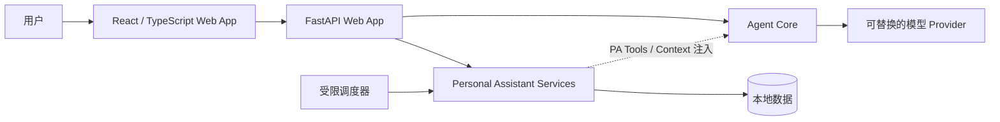
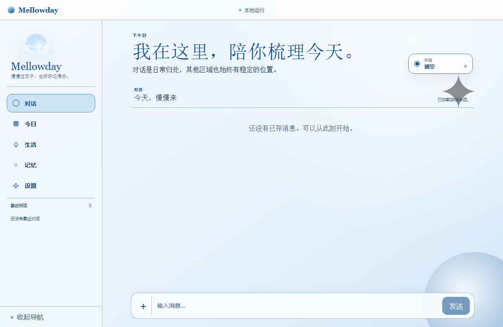
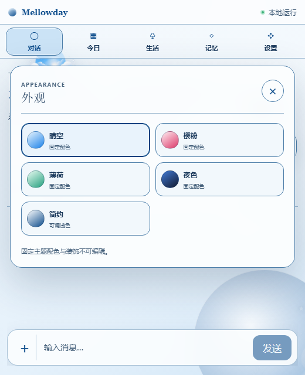

# Mellowday 项目展示与架构说明

Mellowday 是一个面向单用户的本地优先个人助手。项目同时处理两类需求：有连续人格和记忆的对话，以及任务、提醒、日程和笔记等结构化生活记录。核心设计目标是保留自然交互，同时不让人格化表达模糊真实的权限、数据和操作结果。

## 架构

- **Agent Core** 负责模型循环、会话、工具与 Skill 接口、权限、确认和运行时事件，不依赖个人助手或 Web 实现。
- **Personal Assistant** 负责 Persona、Memory、Life Records、Daily Review 和 Proactive Chat。Memory 与任务等结构化记录保持独立的真实来源。
- **Web App** 负责对话、中性管理界面、API 传输与实时事件。前端是 React/Vite 应用，生产产物由 Python 后端托管。
- **Desktop Shell** 已定义为后续 Windows 主入口，但当前仓库尚未实现安装器和便携包；浏览器自托管模式是当前可运行交付物。

## 值得展示的工程决策

1. **用自然意图代替一律弹窗确认。** 明确且可逆的内部操作直接执行；语义不足时先自然澄清；高风险或不可逆操作才进入显式确认。
2. **主动对话是只读能力。** 调度器可以结合安静时段、冷却时间和相关上下文决定是否发送消息，但评估过程没有写工具权限。
3. **对话和管理界面分离语气责任。** Persona 只影响对话内容；设置、诊断、审计和持久化记录始终使用中性、可核验的表达。
4. **发行包不依赖参考工程。** 自定义构建后端在制作 wheel 前验证 Vite manifest 及其引用的所有资源；分发测试还会从无 `chatbot/` 参考树的隔离副本构建。

更完整的设计背景见 [产品方向](product-direction.md) 和 [ADR 目录](adr/)。

## 可验证证据

- [GitHub Actions](https://github.com/Ruacha00/mellowday/actions/workflows/release.yml) 在全新 Ubuntu runner 上安装依赖，执行前端测试、TypeScript 检查、生产前端构建、mypy、Python 测试和 wheel 构建，并上传 wheel 产物。
- 前端单元测试覆盖服务边界、主题派生、路由状态和页面交互；Python 测试覆盖 Agent Core、个人助手服务、API、真实 Chromium 旅程与分发边界。
- 运行时用户数据、Provider 密钥、备份、虚拟环境和只读参考树都被 `.gitignore` 排除。Provider 凭据的 API 和诊断回应有专门的防泄漏测试。

## 界面证据

### 晴空主题桌面布局

### 窄屏外观设置

完整的有界视觉基线见 [Production Web App visual baselines](visual-baselines/issue-48/README.md)。这些截图是浏览器产品证据，不代表尚未实现的 Desktop Shell。

## 三分钟演示路线

1. 在 Settings 中配置一个 OpenAI-compatible Provider，展示密钥只以脱敏状态返回。
2. 在对话中创建任务或提醒，展示明确的可逆意图不需机械确认。
3. 打开 Life 与 Today，展示同一份结构化记录如何被管理和派生汇总。
4. 切换对话、外观与窄屏布局，展示路由恢复、持久状态和可访问的焦点管理。
5. 以 GitHub Actions 绿色记录和 wheel 产物收尾，再打开一个代码边界讲解。

## 面试时可讲解的代码

- `src/mellowday/agent_core/facade.py`：Web 层依赖的公共 Agent Core 边界。
- `src/mellowday/agent_core/actions.py`：自然行动意图、权限与确认的合作方式。
- `src/mellowday/personal_assistant/proactive_chat.py`：主动对话的安静时段、冷却、限额和只读工具边界。
- `frontend/src/conversation/useConversationSession.ts`：前端对话状态、请求生命周期与实时消息整合。
- `tests/test_distribution_boundary.py`：隔离构建与分发包内容边界的可执行证据。
