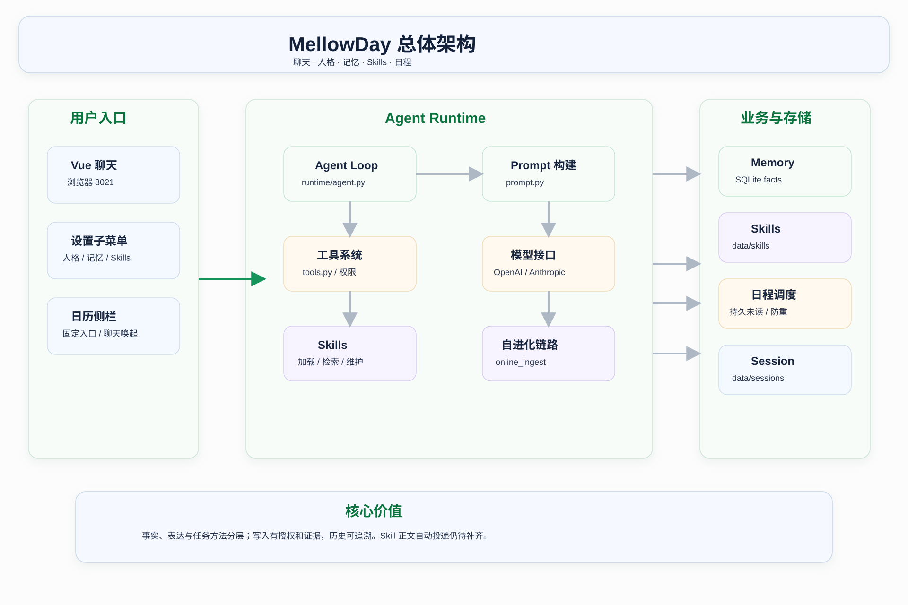
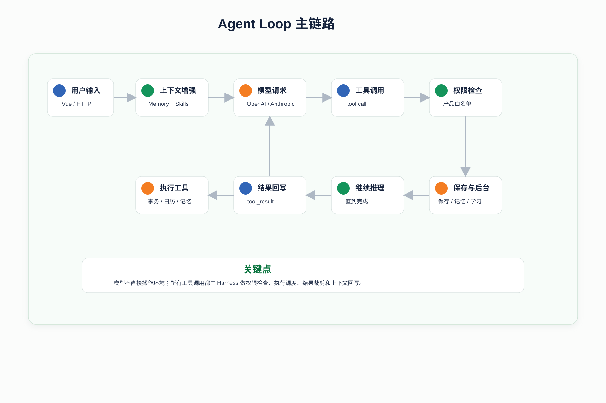
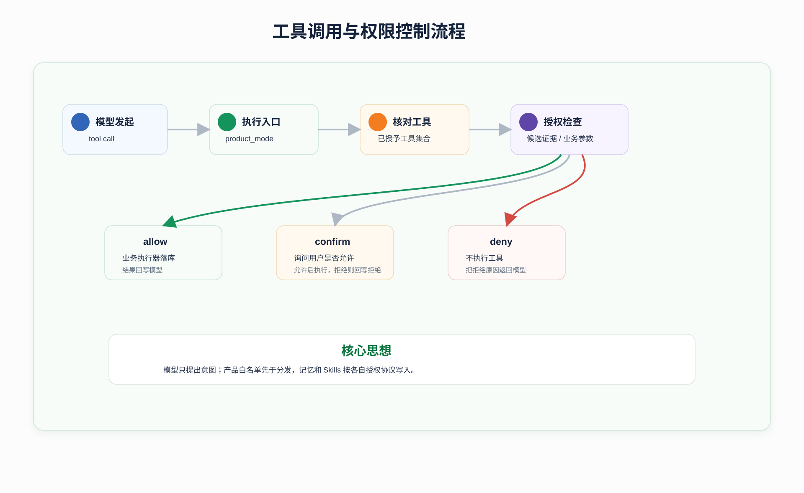

# MellowDay 项目文档总览与完善版

本文是 wiki 的统一入口：MellowDay 是什么、核心链路如何运行、各模块承担什么职责、技术特点如何解释、评测结果说明什么，以及源码应该从哪里开始读。

专题目录：

- [从 0 到 1 学习了解项目](从0到1学习了解项目.md)
- [架构设计](架构设计.md)
- [核心源码阅读指南](核心源码阅读指南.md)
- [技术亮点](技术亮点.md)
- [Skills 自进化逻辑与实现思路](Skills自进化逻辑与实现思路.md)
- [评测部分](评测部分.md)
- [项目经历表达](简历包装.md)

当前范围以 [S18](../specs/S18-chat-first-product-scope.md) 及 S19–S22 为准，基于运行版本 `df9b65d`。历史规格与报告保留原始阶段信息，不作为新增能力承诺。

## 1. 项目一句话定位

MellowDay 是基于 Vue 与 Python 的本地个人助手：用户通过聊天处理日程、提醒、待办与笔记，通过设置维护单一角色、记忆和已学方法。

```text
MellowDay = 聊天交互 + 实际事务工具 + 有限人格适应 + 已保存记忆 + 可学习 Skills
```

模型负责理解和提出 tool call，运行时与业务层负责验证、授权、执行、保存和结果反馈。日常互动由用户开始，仅明确提醒和主动订阅会产生定时消息。

## 2. 核心价值

| 价值 | 说明 |
|---|---|
| 聊天优先 | 日常对话为主；管理内容集中设置，日历按需展开 |
| 状态可核对 | 工具结果、事务记录、完整执行 trace 可查看 |
| 信息分层 | 核心人格、可变表达、用户事实、任务方法、会话状态分别管理 |
| 学习有依据 | 当前轮记忆一次评估；Skill 方法按反馈与授权写入；人格小幅演化 |
| 定时消息可靠保存 | 独立调度器、持久未读、重复防护与恢复补发 |

它面向单用户桌面个人助手使用，不提供编程工作台、随机问候、多角色切换或多端同步。

## 3. 总体架构

| 层级 | 主要文件（相对仓库根目录） | 职责 |
|---|---|---|
| 界面层 | `frontend/src/App.vue`、`frontend/src/conversation/`、`frontend/src/calendar/` | 聊天、设置子菜单、侧边日历和通知气泡 |
| Web 编排层 | [src/mellowday/web_app/app.py](../../src/mellowday/web_app/app.py)、[src/mellowday/web_app/service.py](../../src/mellowday/web_app/service.py) | HTTP/SSE、会话注册、确认、停止与模型配置 |
| 运行时层 | [src/mellowday/runtime/agent.py](../../src/mellowday/runtime/agent.py) | 模型工具循环、双协议、Skills 检索、上下文折叠和恢复 |
| 业务与适应层 | `src/mellowday/personal_assistant/` | 事务工具、人格、本轮记忆、日历与调度 |
| 技能层 | `src/mellowday/runtime/skills/` | 抽取/维护、授权后写入、版本、审计和评测 API |
| 持久化层 | [src/mellowday/storage/store.py](../../src/mellowday/storage/store.py)、[src/mellowday/paths.py](../../src/mellowday/paths.py) | 单一数据根目录、SQLite、会话与技能文件 |

模型负责推理和提出工具调用意图，Runtime 负责真正执行。网页通过 `build_agent(product_mode=True)` 的实际构造路径启用产品边界。

```text
用户输入 → Vue 对话页 → POST /api/chat/{session_id}
  → SessionRegistry：会话串行、配置刷新、确认与事件通道
  → Agent.chat：核心人格 + 可变表达规则 + Skills + 已保存事实
  → 模型返回文本或 tool call
  → 产品工具白名单 → 业务工具 → SQLite → tool result
  → 模型继续回答 → 会话保存
  → 当前轮记忆评估 / 人格适应 / Skill 学习收尾 → done
```

后台 `ScheduleService` 独立投递明确提醒和订阅，网页关闭时仍保留未读。Skill 学习使用上一轮窗口与本轮反馈；记忆与人格提取使用当前原文，不能混为同一条学习链。



## 4. 一次请求如何执行

```text
用户输入 → Vue 对话页 → POST /api/chat/{session_id}
  → SessionRegistry：会话串行、配置刷新、确认与事件通道
  → Agent.chat：核心人格 + 可变表达规则 + Skills + 已保存事实
  → 模型返回文本或 tool call
  → 产品工具白名单 → 业务工具 → SQLite → tool result
  → 模型继续回答 → 会话保存
  → 当前轮记忆评估 / 人格适应 / Skill 学习收尾 → done
```

后台 `ScheduleService` 独立投递明确提醒和订阅，网页关闭时仍保留未读。Skill 学习使用上一轮窗口与本轮反馈；记忆与人格提取使用当前原文，不能混为同一条学习链。

一次请求可包含多个模型/工具回合。主回复结束后仍可能有记忆确认、人格评估和 Skill 学习；辅助请求有独立耗时。停止会取消当前 runner，关闭未完成确认，不能仅停止打字动画。



## 5. 核心模块职责

### 5.1 Web 入口与会话编排

[src/mellowday/web_app/app.py](../../src/mellowday/web_app/app.py) 注册 HTTP、确认、停止及设置路由，lifespan 启停调度器。`service.py` 创建实际 Agent、恢复会话、串行处理一轮，连接执行器、事实来源与事件流。

### 5.2 `runtime/agent.py`

管理双协议客户端、消息历史、工具循环、事实和 Skill 注入、上下文折叠、会话保存，以及后台学习。`product_mode=True` 决定网页能力边界。

### 5.3 业务工具与存储

`personal_assistant/tools.py`、`schedule_tools.py` 定义实际工具；`storage/store.py` 是 records 与撤销的事务层。Web 为 remember 提供仅当前轮的提取器。

### 5.4 Prompt 与人格

`runtime/prompt.py` 定义基础个人助手约束，`persona.py` 提供核心描述与示例，`persona_adaptation.py` 负责有证据的小幅表达变化。变更从后续请求生效。

### 5.5 Skills

`runtime/skills/` 负责 SKILL 文件发现、词项检索、候选描述注入、在线抽取/维护、版本与审计。设置提供编辑、停用、恢复和回退；网页不提供 skill/fork 工具。

### 5.6 本轮记忆与召回

`personal_assistant/turn_memory.py` 从当前原文提取一次；`tools.py::build_fact_provider()` 提供 SQLite 有效事实，`runtime/memory.py` 负责召回与失效通知。旧对话不被扫描创建新记忆。

### 5.7 日历和定时消息

`calendar_store.py` 提供区间、时区、重复和单次例外。`schedule.py` 管理明确提醒、订阅、持久未读与实例去重；接收会话删除后暂停订阅。

### 5.8 前端

`frontend/src/conversation/` 管理聊天与 SSE；`settings/` 收纳管理；`calendar/` 提供 FullCalendar 侧栏与独立通知气泡。Vue 页面由 Nginx 提供，同源代理 API。

## 6. 自主会话记忆折叠

长程任务中，原始对话、工具结果、失败尝试和中间分析会不断膨胀。简单截断历史会丢失关键状态，简单摘要又容易忽略工具经验。MellowDay 的自主会话记忆折叠把长对话压成面向继续执行的结构化 session state。

折叠状态分三层：

| 层级 | 保存内容 |
|------|----------|
| `episode_memory` | 任务描述、关键事件、整体进展 |
| `working_memory` | 当前子目标、阻塞点、待办事项、下一步动作 |
| `tool_memory` | 已用工具、有效参数、失败原因、工具返回模式 |

触发方式有两类：

- 模型主动调用 `compact_context`。
- Runtime 在上下文接近阈值时自动触发。

它的价值不是单纯省 token，而是让 Agent 在长任务中完成状态重组：保留目标、证据、工具经验和下一步方向，减少失败路径继续污染后续推理。

需要注意：当前会话记忆折叠是 session 级状态折叠，不等同于跨会话已保存事实。折叠产物会保存到 `<data>/sessions/`，主要用于任务延续和审计。

## 7. Skills 自进化闭环

Skills 自进化是 MellowDay 的任务方法学习机制。它解决的问题是：用户在对话中给出的稳定偏好和工作方法，不能只停留在当前上下文里，而应该沉淀成未来可复用的 `SKILL.md`。

自进化链路如下：

```text
当前轮用户任务 + assistant 回复
  -> 保存 pending window
下一轮用户输入作为反馈证据
  -> Extractor 抽取最多一个可复用候选
  -> Maintainer 判断 add / merge / discard
  -> 完整变更授权 / 必要时确认
  -> create_skill_file() 或 evolve_skill_file()
  -> 记录 provenance、history、usage stats
```

### 7.1 为什么使用 pending window

系统不会在当前任务结束后马上让模型“猜自己学到了什么”。它会先保存当前轮窗口，等待下一轮用户输入。

例如下一轮用户说：

```text
以后这类报告都要先给可直接使用的初稿，不要连续追问。
```

这类反馈更像稳定偏好，适合被抽取成 Skill。pending window 让系统把“上一轮任务 + 上一轮回答 + 下一轮反馈”一起作为证据，减少误沉淀一次性内容。

### 7.2 Extractor 的职责

Extractor 只负责抽取候选，不负责写文件。

它只应抽取：

- 未来同类任务仍适用的方法。
- 用户明确表达的输出偏好。
- 稳定纠正。
- 可复用工作流。

它不应抽取：

- 一次性任务内容。
- 隐私、密钥、账号、URL。
- 精确日期和临时参数。
- 只有 assistant 自己推测出来的规则。

### 7.3 Maintainer 的职责

Maintainer 负责维护 Skill 集合，输出三类动作：

| 动作 | 含义 |
|------|------|
| `add` | 新增独立 Skill |
| `merge` | 合并进已有 Skill |
| `discard` | 重复、低价值、证据不足或不适合沉淀 |

实现上会先做相似 Skill 检索和 exact identity 判断，优先 merge，谨慎 add，避免 Skill 数量失控。

### 7.4 审计和治理

自进化不是黑盒写 prompt。相关产物包括：

```text
<data>/skill_evolution/usage.jsonl
<data>/skill_evolution/online_provenance.jsonl
<data>/skill_evolution/online_skill_provenance.json
<data>/skill_evolution/skill_usage_stats.json
<data>/skill_evolution/history/
<data>/skills/.archive/
```

这些文件分别支持：

- 查看 Skill 来源。
- 回溯每次 add / merge / discard。
- 保存演化前版本快照。
- 统计 retrieved / relevant / used。
- 归档长期无效 Skill。

## 8. Skills 质量评测

仅仅自动创建 Skill 不代表它一定正确。MellowDay 还设计了在线 Skills 评测链路，用来观察 Skill 是否真正有效。

评测流程可以概括为：

```text
读取 provenance / usage stats / active skills
  -> 构造 replay pool
  -> 从 SKILL.md 编译规则
  -> 对历史 assistant 输出做规则评测
  -> 可选 LLM judge
  -> 生成 candidate variants
  -> replay 候选版本
  -> 满足 gate 时写入 champion 记录
```

关键点：

- replay 样本来自真实在线沉淀记录。
- 规则评测包括非空、JSON、表格、引用来源、结论前置等可程序化检查。
- LLM judge 用于判断回复是否满足 Skill 指令。
- candidate variants 是候选改进，不会自动覆盖 active `SKILL.md`。
- champion 是本地健康版本记录，用于质量观察和后续人工决策。

这个设计让 Skills 自进化具备可回放、可比较、可审计的工程边界。

## 9. 工具与权限体系

产品模式在 `_execute_tool_call()` 的分发前检查工具名，未授予工具返回 `tool_not_available`。MCP 首次连接被跳过，Plan 切换无效，网页不提供 Shell、文件编辑、`agent`、`skill`/fork 或手动 `skill_create` 工具。

后台 Skills 检索与学习仍运行；它们和模型可调用工具是不同入口。可逆业务操作走类型校验和操作记录，记忆/Skill 提案走各自授权协议。Skill 自动授权评估完整变更，而不是截断预览；不确定时进入确认。

这些边界是应用层能力限制，不是操作系统沙箱。应用当前没有账户鉴权，Compose 默认仅绑定 `127.0.0.1`，不应直接公开到公网。



## 10. 评测结果总结

| 验证范围 | 已有结果 | 证据 |
|---|---|---|
| 聊天优先版本后端 | 全量 599 项；随后新增星期订阅测试通过，日历专项 15 项 | [CF 验收](../evidence/CF-acceptance.md) |
| Vue / 类型 / 构建 | 48 项，生产构建通过 | [CF 验收](../evidence/CF-acceptance.md) |
| 隔离 Chromium + 真实 HTTP | 13 组流程，0 页面异常；模型为脚本化替身 | [CF 验收](../evidence/CF-acceptance.md) |
| 既有真实模型 | R4 运行时 19/19、核心演示 24/24 | [R4 验收](../evidence/R4-acceptance.md)，属于较早版本 |
| Skills 三条件对照 | 共 18 个真实模型样本；并非稳定提升结论 | [P5](../../evals/README.md) |

当前版本没有 GAIA/HLE 成绩。不得把其他项目的百分比换名后作为 MellowDay 的结果。最新记忆授权、人格演化的真实模型长期质量仍待专门评估；测试通过不等于语义判断总是正确。

## 11. 推荐源码阅读路线

1. [README](../../README.md) 与 [当前范围 S18](../specs/S18-chat-first-product-scope.md)。
2. [src/mellowday/web_app/__main__.py](../../src/mellowday/web_app/__main__.py)、`app.py`、`service.py`。
3. [src/mellowday/runtime/agent.py::Agent.chat()](../../src/mellowday/runtime/agent.py) 与 `_execute_tool_call()`。
4. [src/mellowday/personal_assistant/tools.py](../../src/mellowday/personal_assistant/tools.py)、`schedule_tools.py` 和 `storage/store.py`（位于 `src/mellowday/`）。
5. [src/mellowday/personal_assistant/persona.py](../../src/mellowday/personal_assistant/persona.py)、`persona_adaptation.py`、`turn_memory.py`。
6. `src/mellowday/runtime/skills/` 下的检索、在线演化、版本和评测模块。
7. [src/mellowday/runtime/sessions.py](../../src/mellowday/runtime/sessions.py)、`session_memory.py`、`memory.py`。
8. [src/mellowday/personal_assistant/calendar_store.py](../../src/mellowday/personal_assistant/calendar_store.py)、`schedule.py` 和前端日历/通知组件。

先主链路，再支撑模块；先看怎么运行，再看怎么沉淀。源码链接和具体学习问题见[核心源码阅读指南](核心源码阅读指南.md)。

## 12. 适合讲解的技术亮点

1. 模型工具循环与 Web 生命周期接线，同会话串行、流式输出、确认与停止。
2. 核心人格与可变表达分离，有限自动演化与版本回退。
3. 本轮记忆候选、授权、快照冲突检查和事务幂等，防止删除后旧轮重建。
4. Memory、Skill、会话折叠分层；Skill 经完整变更授权与版本记录。
5. 折叠输入与完整 trace 独立，长工具原文通过受限 ref 取回。
6. 区间日历、时区重复、单次例外、持久调度与未读消息。
7. 双容器部署、原卷备份与升级验证。

工程能力与真实模型质量分别验证，不使用未经复现的通用基准成绩。

## 13. 面试表达精简版

30 秒版本：

> MellowDay 是以聊天为主的本地个人助手。我在实际参与范围内完成运行时适配和产品工程，把模型工具循环与 Vue、FastAPI、SQLite 接起来。系统将核心人格、可变表达、用户事实和任务方法分开管理；记忆只评估当前轮，Skills 按反馈与授权演化，日程通过侧边日历和持久提醒形成完整使用流程。

简历用语按实际贡献调整，详见[项目经历表达](简历包装.md)。不要将运行时全部机制表述为从零独创。

## 14. 当前实现边界

**本轮文档源码核验发现：Skill 正文自动投递尚未接通。** 当前检索只注入名称、描述与触发条件，同时网页禁用 skill 工具。学习、落盘、设置管理是真实功能，但不能声称完整规则已参与后续模型回答。修复应作为下一步优先项，并重新验证真实请求载荷。

- 单用户、单角色、桌面浏览器；管理内容收进设置。
- 没有 MCP、Plan Mode、产品子代理与 Shell 工具入口。
- 核心人格由用户编辑，可变人格自动小幅变化；语义判断仍依赖模型。
- 自动记忆候选先确认，只处理当前轮；已保存事实仍可跨会话召回。
- 定时消息仅来自明确提醒或主动订阅。无系统推送，关闭网页后保留未读。
- 汇报模板为投递当天日程，周频率不代表整周汇总；单次重复例外没有独立撤销。
- Skills 评测 candidate/champion 是评测产物，不自动替换活动规则。
- 最新行为通过离线与浏览器验收，真实模型的长期演化质量仍待专项。

## 15. 后续可完善方向

下一步以真实使用验收为先：冻结记忆/人格/日程对话案例，在隔离数据下记录模型表现与耗时，修复误保存、过度变化、多余确认和聊天中断。确认现有当天日程汇报价值后，再决定自定义主题或整周汇报。

不以新增 MCP、Plan 或子 Agent 作为当前路线。

## 16. 最短学习路径

```text
README → 本文 → 架构设计 → web_app/service.py
  → runtime/agent.py::Agent.chat / _execute_tool_call
  → personal_assistant/turn_memory.py / persona_adaptation.py / schedule.py
  → runtime/skills/ → 评测部分
```

应能讲清“聊天进入实际运行时、授权后工具落库、信息分层、学习与投递如何被验证”，再深入各模块实现。
